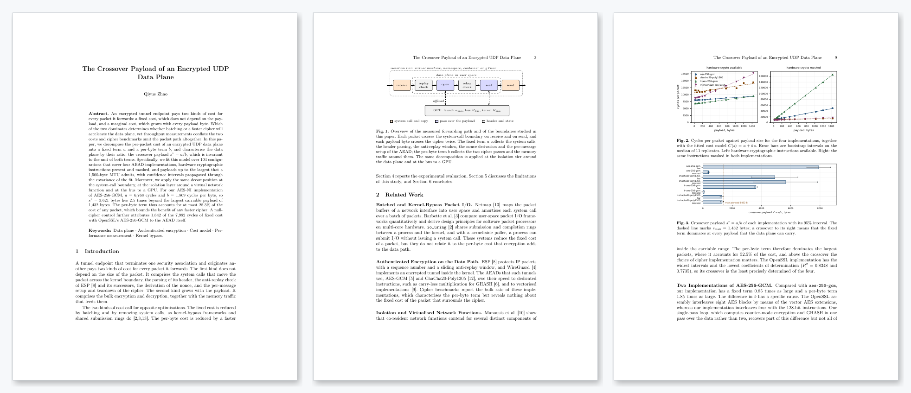
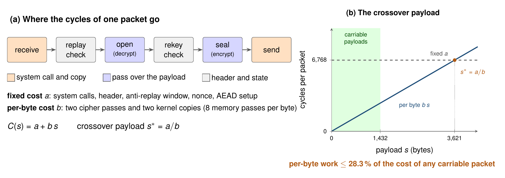
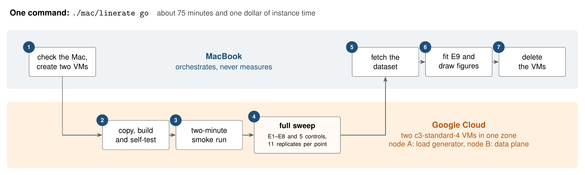
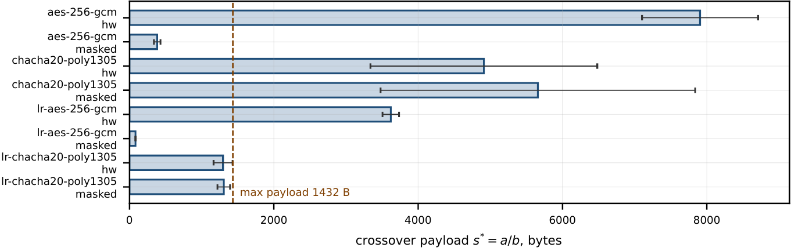
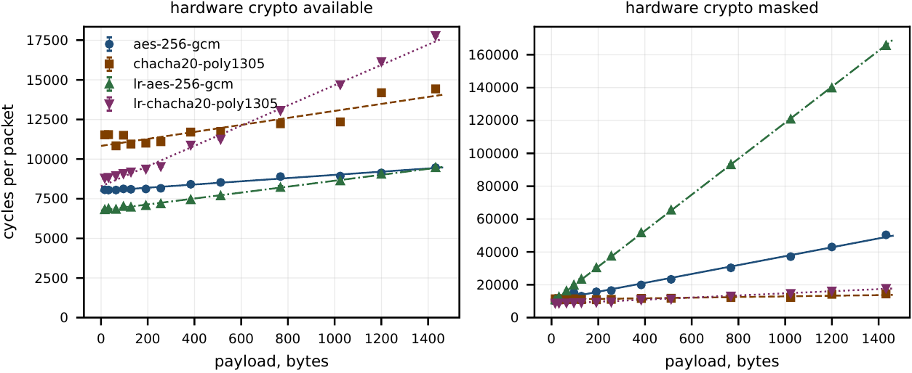

<h1 align="center">linerate</h1>

<p align="center">
  <b>The Crossover Payload of an Encrypted UDP Data Plane</b><br>
  Qiyue Zhao
</p>

<p align="center">
  <a href="Technical%20Report.pdf"></a>
</p>

<p align="center">
  
  
  
  
  <a href="LICENSE"></a>
</p>

> 🇫🇷 **Résumé.** Pour chaque paquet qu’il retransmet, un point de terminaison de tunnel chiffré paie un coût fixe *a*, indépendant de la charge utile, et un coût *b* par octet. Ce projet mesure ces deux termes sur un plan de données UDP chiffré écrit en C++ et les résume par leur rapport *s*\* = *a*/*b*, la charge utile de croisement, qui ne dépend pas de l’unité de mesure. Sur 104 configurations, notre implémentation d’AES-256-GCM avec AES-NI donne *s*\* = 3 621 octets, bien au-delà des 1 432 octets qu’admet une MTU de 1 500 octets : même en supprimant tout coût par octet, le débit en paquets n’augmenterait que d’un facteur 1,40 au plus. La même décomposition est appliquée à la frontière des appels système, à l’isolation d’une fonction réseau virtualisée et au bus vers un GPU.

## At a glance

| 🎯 **Question** | What limits an encrypted tunnel endpoint: the cost of each packet, or the cost of each byte? |
|:---|:---|
| 💡 **Answer** | The packet. The crossover payload **`s*` = 3,621 B** exceeds the largest carriable payload of **1,432 B**, so per-byte work is at most **28.3 %** of the cost of any packet, and even a free cipher would raise the packet rate by at most **1.40×**. |
| 🛠️ **Built** | A C++ encrypted UDP data plane with four I/O paths (POSIX, `recvmmsg`/`sendmmsg`, io_uring, io_uring SQPOLL) and two AEADs written from scratch: AES-256-GCM with AES-NI and PCLMULQDQ, and ChaCha20-Poly1305 with AVX2 or NEON, both byte-identical to OpenSSL. |
| 📐 **Method** | 104 configurations × 11 replicates, bootstrap confidence intervals, weighted least squares with covariance-propagated intervals, randomised interleaved sweeps, and 5 controls whose predictions were fixed in advance. |
| ☁️ **Automation** | `./mac/linerate go` creates two Google Cloud VMs, builds, self-tests, sweeps, fetches the dataset, draws the figures and deletes the VMs, in about 75 minutes. |

<p align="center">
  <a href="Technical%20Report.pdf"></a><br>
  <sub>📄 <a href="Technical%20Report.pdf"><b>Technical Report.pdf</b></a> · 18 pages, Springer LNCS format: cost model, two propositions, evaluation and controls</sub>
</p>

## How it works

<p align="center">
  
</p>

Every packet runs the same loop: receive, replay check, open, rekey check, seal, send. Work that does not depend on the payload forms the fixed term `a`; the two cipher passes and the copies around them form the per-byte term `b`. If the crossover `s* = a/b` lies beyond the largest payload the link can carry, no per-byte optimisation can change much.

<p align="center">
  
</p>

| | What it measures |
|---|---|
| **E1** | `a`, `b` and `s*` for 4 AEAD implementations × hardware crypto on and off × 13 payloads |
| **E2** | strong and weak scaling of independent shards, in one node and across nodes |
| **E3** | the cost of the system-call boundary across four transports and batch depths |
| **E4** | the memory roof: sustained bandwidth divided by the passes each payload byte makes |
| **E5** | tail latency against offered load, with an open-loop generator |
| **E6** | independent references: `openssl speed`, `iperf3` and WireGuard |
| **E7** | isolation tiers (VM, namespace, container, gVisor) and service function chaining |
| **E8** | GPU offload: launch cost, bus transfer and kernel rate |
| **E9** | tail-latency prediction for admission control, against a static threshold |
| **Controls** | null cipher · hardware mask · idle polling · forged packet · every cipher constructible |

## Results

<p align="center">
  <br>
  <sub>Crossover payload of each implementation with its 95 % interval. To the right of the dashed line at 1,432 B, the fixed cost dominates every packet the data plane can carry.</sub>
</p>

<p align="center">
  <br>
  <sub>Cycles per packet against payload size with the fitted model <code>C(s) = a + b·s</code>, hardware crypto available (left) and masked (right).</sub>
</p>

| Finding | Value |
|---|---|
| Crossover payload, AES-256-GCM (ours, AES-NI) | **3,621 B** (95 % CI 3,505–3,736) |
| Largest per-byte share of the cost of any carriable packet | **28.3 %**, so removing all per-byte work gains at most **1.40×** |
| Crossover payload, ChaCha20-Poly1305 (ours) | **1,296 B**, inside the carriable range |
| Per-byte cost with hardware crypto masked | **×26.7** (OpenSSL) and **×58.6** (ours) |
| Ours against OpenSSL, AES-256-GCM | fixed term **×0.85**, per-byte term **×1.85** |
| Fixed cost owned by the AEAD itself (null-cipher control) | **1,642** of 7,982 cycles |
| Batching: `mmsg` at B = 64 against `posix` | **−12.3 %** cycles per packet |
| io_uring SQPOLL at B = 1, on a VM with two physical cores | **3.3×** the cost of `posix`, because the poller competes for a core |
| Strong scaling with two shards | speedup **1.816**, serial fraction 0.101 |
| Memory roof | 13.7 GB/s triad bandwidth, hence **1.71 GB/s** of payload |
| Validation controls | **5 of 5 passed** |

## Repository structure

```text
linerate/
├── Technical Report.pdf   the technical report
├── RUNBOOK.md             operating manual: setup, commands, troubleshooting
├── mac/                   one-command driver (go, up, run, watch, fetch, figures, down)
├── cloud/                 VM side: bootstrap, sweep, baselines, netem, isolation tiers, chaining
├── src/
│   ├── core/              data plane: protocol, replay window, AEADs (OpenSSL and SIMD), transports
│   ├── bench/             experiments E1–E8 and the controls
│   ├── apps/              self-test, load-generator daemon, packet source and sink
│   ├── mpi/               cross-node scaling (optional)
│   └── cuda/              GPU AEAD offload (optional)
├── include/lr/            headers
├── python/                E9 and the figures (make_figures.py, lr/)
├── tools/                 host doctor, dataset merge, wiring checks
├── docs/                  methodology, environment, schema, limitations, Mac workflow
├── assets/                images used in this README
├── setup.sh, run.sh       build and self-test; run the experiments
└── CMakeLists.txt, Makefile, requirements.txt, LICENSE
```

## Requirements

| | Required | Optional |
|---|---|---|
| **Measurement host** | Linux (x86-64 or aarch64), CMake ≥ 3.20, a C11 and C++17 compiler, OpenSSL ≥ 3.0 | liburing, OpenMP, MPI, CUDA, iperf3, WireGuard, Docker with gVisor, `tc` |
| **Analysis** | Python 3 with NumPy and Matplotlib | scikit-learn (E9) |
| **Driver** | macOS with Bash, Python 3 and the Google Cloud SDK | — |

Each optional component that is missing removes one experiment, and the dataset records which one and why.

## Usage

> 📘 **The complete operating manual is [RUNBOOK.md](RUNBOOK.md)**: first-time setup, every command, what normal output looks like, and what to do when a step fails.

```bash
# The whole study, from a Mac with a Google Cloud account (about 75 minutes)
./mac/linerate go --project <your-project-id>

# A two-minute smoke run on a single Linux machine
./setup.sh && ./run.sh --quick
```

> [!WARNING]
> `go` deletes the other VM instances on the Google Cloud account before it starts, so that nothing else on the same hardware perturbs the measurement. Read the [RUNBOOK](RUNBOOK.md) first.

The dataset is written to `results/results.json` and the figures to `results/figures/`. Further reading: [methodology](docs/methodology.md), [environment](docs/environment.md), [dataset schema](docs/schema.md), [limitations](docs/limitations.md), [Mac workflow](docs/mac-workflow.md).

## Citation

```bibtex
@misc{zhao2026crossover,
  author       = {Qiyue Zhao},
  title        = {The Crossover Payload of an Encrypted {UDP} Data Plane},
  howpublished = {Technical report},
  year         = {2026},
  url          = {https://github.com/QiyueZhao-Academic/linerate}
}
```

## Licence

Released under the [MIT licence](LICENSE).
